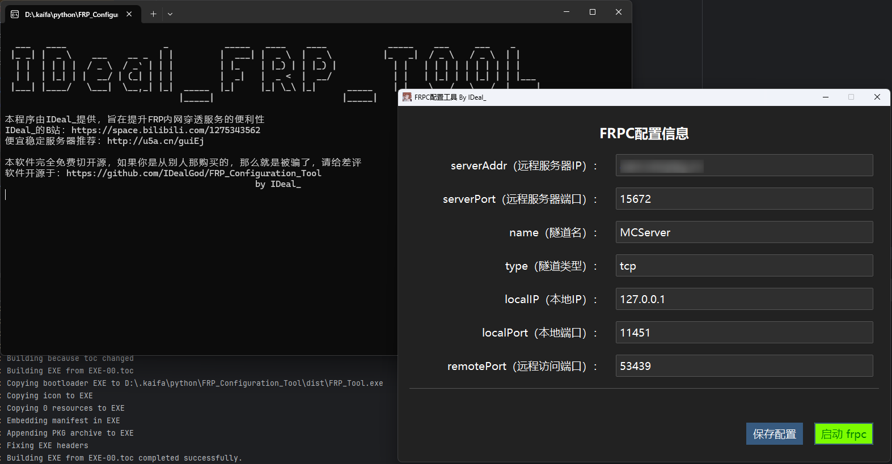

# FRP Configuration Tool

一个基于 Python 开发的 FRP 客户端图形化配置工具，帮助用户快速配置和管理 FRP 内网穿透服务。

## 功能特性

- 🖥️ 图形化界面配置 FRP 客户端
- 🌙 自动适配系统深色/浅色主题
- ⚡ 一键启动 FRP 服务
- 📝 配置文件可视化编辑
- 🔄 实时显示 FRP 运行状态
- 🏷️ 支持多隧道配置管理
- 🎨 现代化 UI 设计 (ttkbootstrap)

## 系统要求

- Windows
- FRP 客户端文件 (`frpc.exe` 和 `frpc.toml`)

## 安装指南

- 从 [Releases](https://github.com/IDealGod/FRP_Configuration_Tool/releases/) 下载最新版
- 将软件与Frpc.exe和Frpc.toml放在同一目录下
- 运行软件即可修改配置信息
  
## 贡献指南
### 欢迎提交 Issue 或 Pull Request！

1. Fork 本项目
2. 创建你的分支 (git checkout -b feature/your-feature)
3. 提交更改 (git commit -m 'Add some feature')
4. 推送到分支 (git push origin feature/your-feature)
5. 创建 Pull Request

## 开源协议
### 本项目采用 GNU General Public License v3.0 开源协议。

## 信息

- 作者：IDeal_
- 项目地址：https://github.com/IDealGod/FRP_Configuration_Tool
